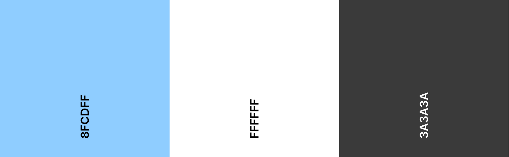

## Be Kind To Your Mind
Be Kind To Your Mind is a support site for people who may be struggling with their own mental health or maybe just want to learn more about mental health and mindfulness therefore the target audience for the site being a wide demographic. 

The Intent of the site is to provide users with a positive experience so they can learn clearly about the world of mindfulness and improving one's mental health.

The Deployed site can be found [HERE](https://scottsmyth56.github.io/BeKindToYourMind/)

## Tabel of Contents
+ [UX](#ux "UX")
  + [Site Goal](#site-goal "Site Goal")
  + [Audience](#audience "Audience")
  + [Communication](#communication "Communication")
  + [Current User Goals](#current-user-goals "Current User Goals")
  + [New User Goals](#new-user-goals "New User Goals")
+ [Design](#design "Design")
  + [Colour](#colour "Colour")
  + [Typography](#typography "Typography")
  + [Imagery](#imagery "Imagery")
+ [Features](#features "Features")
  + [Existing Features](#existing-features "Existing Features")
+ [Testing](#testing "Testing")
  + [Validator Testing](#validator-testing "Validator Testing")
  + [Unfixed Bugs](#unfixed-bugs "Unfixed Bugs")
+ [Technologies Used](#technologies-used "Technologies Used")
  + [Main Languages Used](#main-languages-used "Main Languages Used")
  + [Frameworks, Libraries & Programs Used](#frameworks-libraries-programs-used "Frameworks, Libraries & Programs Used")
+ [Deployment](#deployment "Deployment")
+ [Credits](#credits "Credits")
  + [Content](#content "Content")
  + [Media](#media "Media")

## UX
### Site Goal:
- Provide users reliable information on mindfulness and positive mental health.
- Provde users access to mental health support resources.

### Audience:
The Audience for this site avails to all demographics of people looking to improve their mental health or keep up to date with latest information on mental health and mindfulness.

### Communication:
Information throughout the site is easily readable and distuingishable from each element to the next with the use of white space and colour contrast. 
The user knows their location throughout the site by referring to the navigation link which will be marked based on the users location on the site.

### Current User Goals:
- Keep up to date with positive mental health techniques.
- Find Mental Health support.

### New User Goals:
- Find information on Mental Health and Minfulness
- Find Mental Health Support
- Navigate through the sites content and find information with ease.

## Design

### Colour:

The aim of the colour scheme was to provide a "soothing" and "calm" feeling to the site and not overload the user's senses with harsh colours or elements.
The Lightblue colour choice was motivated through research and the pyschological impact colours have on a person with portraying feelings of calm and serenity.
The Secondary colours were chosen for good contrast on the lightblue primary colour.

### Typography

The main typography used throughout the site was Oswald.This a clean and professional looking font which allowed for users to put their trust into a site where they recieve vital information from.

### Imagery & Icons

Images displayed throughout the site have been sourced from free stock photo websites. The Icons also seen throughout the sight were obtained from Free icon platforms. The goal of the images used was to create a relatable scene for users whilst also improving the appeearance of the site.

### Layout

The layout is needed for the site to flow well and information be found and read easily. This was achieved by creating white space around the site's elements on each page. The layout was coded after designing wireframes to give an initial feel of how the site would flow.

The Wireframes for the site layout can be accessed [HERE](https://scottsmyth56.github.io/BeKindToYourMind/)

