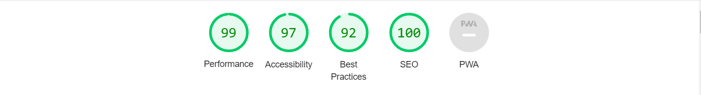

## Be Kind To Your Mind
Be Kind To Your Mind is a support site for people who may be struggling with their own mental health or maybe just want to learn more about mental health and mindfulness therefore the target audience for the site being a wide demographic. 

The Intent of the site is to provide users with a positive experience so they can learn clearly about the world of mindfulness and improving one's mental health.


The Deployed site can be found [HERE](https://scottsmyth56.github.io/BeKindToYourMind/)

## Table of Contents
+ [UX](#ux "UX")
  + [Site Goal](#site-goal "Site Goal")
  + [Audience](#audience "Audience")
  + [Communication](#communication "Communication")
  + [Current User Goals](#current-user-goals "Current User Goals")
  + [New User Goals](#new-user-goals "New User Goals")
+ [Design](#design "Design")
  + [Colour](#colour "Colour")
  + [Typography](#typography "Typography")
  + [Imagery](#imagery "Imagery")
  + [Layout](#layout "Layout")
+ [Features](#features "Features")
  + [Current Features](#current-features "Current Features")
  + [Future Features](#future-features "Future Features")
+ [Testing](#testing "Testing")
  + [Form Data](#form-data "Form Data")
  + [Lighthouse](#lighthouse "Lighthouse")
  + [HTML Validation](#html-validation "HTML Validation")
  + [CSS Validation](#css-validation "CSS Validation")
  + [Unfixed Bugs](#unfixed-bugs "Unfixed Bugs")
+ [Technologies Used](#technologies-used "Technologies Used")
  + [Languages Used](#languages-used "Languages Used")
  + [External Programs and Libraries Used](#external-programs-and-libraries-used "External Programs and Libraries Used")
+ [Deployment](#deployment "Deployment")
+ [Credit](#credit "Credit")
  + [Content](#content "Content")
  + [Media](#media "Media")
  + [Code](#code "Code")

## UX
### Site Goal:
- Provide users reliable information on mindfulness and positive mental health.
- Provde users access to mental health support resources.

### Audience:
The Audience for this site avails to all demographics of people looking to improve their mental health or keep up to date with latest information on mental health and mindfulness.

### Communication:
Information throughout the site is easily readable and distuingishable from each element to the next with the use of white space and colour contrast. 
The user knows their location throughout the site by referring to the navigation link which will be marked based on the users location on the site.

### Current User Goals:
- Keep up to date with positive mental health techniques.
- Find Mental Health support.

### New User Goals:
- Find information on Mental Health and Minfulness
- Find Mental Health Support
- Navigate through the sites content and find information with ease.

## Design

### Colour:

The aim of the colour scheme was to provide a "soothing" and "calm" feeling to the site and not overload the user's senses with harsh colours or elements.
The Lightblue colour choice was motivated through research and the pyschological impact colours have on a person with portraying feelings of calm and serenity.
The Secondary colours were chosen for good contrast on the lightblue primary colour.


### Typography

The main typography used throughout the site was Oswald.This a clean and professional looking font which allowed for users to put their trust into a site where they recieve vital information from.

### Imagery

Images displayed throughout the site have been sourced from free stock photo websites. The Icons also seen throughout the sight were obtained from Free icon platforms. The goal of the images used was to create a relatable scene for users whilst also improving the appearance of the site.

### Layout

The layout is needed for the site to flow well and information be found and read easily. This was achieved by creating white space around the site's elements on each page. The layout was coded after designing wireframes to give an initial feel of how the site would flow.

The Wireframes for the site layout can be accessed [HERE](/assets/images-readme/)

## Features 

### Current Features 

#### Landing Page 

This is the first view once a user lands on the site, The aim was to not overload and ease the user into the sight.
Personal motivation to boost the user is portrayed in a daily quote in the hero image


#### Techniques to Improve Mental Health

This section allows users to get a basic understanding of some of the techniques to improve your mental health
When a user hovers over one of the tiles the shorthand information is displayed with access to extended content on the chosen technique


#### 5 Second Stress Relievers

This section was added to give users a quick relief from stress or anxiety, This is done by small action paragraphs with an action icon displayed above.
On Hover the tiles are interactive.


#### Mental Health Apps and Podcasts

This section gives the user options to external Mental Health Podcasts and Mobile Apps. This is displayed in an interactive carousel with links for each resource on the banner images.


#### Mindfulness and Mental Health Accordion

This element gives the user more information on mindfulness and mental health and answers some of the main questions around the areas. This is achieved by implementing an accordion element giving the user the option to view and close the content on command by clicking on each accordion element.


#### More Information Video Elements

This section gives the user to sit back and watch or listen to two popular videos explaining mindfulness and mental health. These are embedded Iframes from youtube.


#### Extended Techniques to improve mental health

This section shows the extended information on the techniques to improve mental health from the tiles on the homepage.


#### Booking a call with a counsellor

This form element allows the user who may need some additional support to book a call with a certified counsellor.


#### Helplines and Support

This section displays tiles to some popular helplines and support platforms. When the mouse is hovered over each tile the contact information and link to the Support line is displayed.


#### Booking Confirmation

This Window displays a confirmation message to let the user know their booking request has been successful


### Future Features

- Live Support Chat.
- Mindfulness Courses.
- How to help people around you with mental health issues.

## Testing

### Form Data 

- The form data to the action sends the values through the request succesfully, as this is a static site the values could not be displayed on the form confirmation page without the use of different frameworks.


### Lighthouse

##### Link Reference
- Links on the .next and .prev buttons on the carousel needed to reference something. As i was using these buttons to slide the carousel it didnt link anything.
###### Solution
```
href="javascript:void(0)";.
```
[Credit for Solution](https://stackoverflow.com/questions/1291942/what-does-javascriptvoid0-mean)

##### Performance Issue loading png files

- The sites performance was setback by using png image files.

###### Solution

- Convert all png files to webp files to increase performance

### Lighthouse Test Results



### HTML Validation

#### Button cannot be a decendant of Anchor tag

- Initally the buttons were implemented with an anchor tag surrounding. This threw up an error in the validator

###### Solution

- Remove the button and style the anchor tag as a button
```
 background-color: white;
    color: #3a3a3a;
    padding: 7px 7px;
    transition: all 1s;
    text-transform: uppercase;
```
### Validation Results
 
 - All HTML pages passed validation with no errors.
 


### CSS Validation

CSS page passsed validation with no errors


 ### Unfixed Bugs
  ##### No Unfixed Bugs


## Technologies Used


### Languages Used
- HTML5
- CSS3
- Javascript

### External Programs and Libraries Used
- Google Fonts - for the font family.
- Font Awesome - to add icons to the social links in the footer element.
- GitPod - to creat my html files & styling sheet before pushing the project to Github.
- GitHub - to store my repository for submission.
- Free-Convert - to convert png files to wepb.
- Am I Responsive? - to ensure the project looked good across all devices.
- Favicon - to provide the code & image for the icon in the tab bar.

## Deployment
The site was deployed to GitHub pages. The steps to deploy are as follows:

- In the GitHub repository, navigate to the Settings tab
- From the source section drop-down menu, select the Master Branch
- Once the master branch has been selected, the page will be automatically refreshed with a detailed ribbon display to indicate the successful deployment.

The Deployed site can be found [HERE](https://scottsmyth56.github.io/BeKindToYourMind/)


## Credit

### Content
- https://www.cdc.gov/mentalhealth/learn/index.htm
- https://www.thehealthy.com/mental-health/stress/quick-stress-relief/
- https://www.aware.ie/
- https://www.helpguide.org/articles/stress/quick-stress-relief.html
- https://www2.hse.ie/mental-health/self-help/activities/mindfulness/
- https://www.helpguide.org/articles/healthy-living/the-mental-health-benefits-of-exercise.html
- https://www.mentalhealth.org.uk/explore-mental-health/a-z-topics/diet-and-mental-health
- https://www.mercycare.org/bhs/
- https://www.mhcirl.ie/
- https://turn2me.ie/
- https://spunout.ie/

### Media

#### Images

All Images used came from https://www.pexels.com/

All Icons used came from:
- https://icons8.com/
- https://fontawesome.com/

#### Videos

https://youtu.be/3nwwKbM_vJc
https://youtu.be/rkZl2gsLUp4

### Code

- Carousel Code Extracted from: https://www.w3schools.com/howto/howto_js_slideshow.asp
- Accordion Code Extracted From: https://www.w3schools.com/howto/howto_js_accordion.asp


